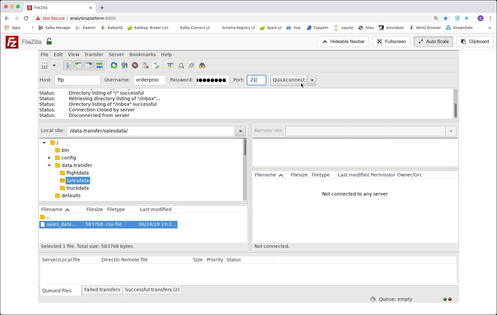
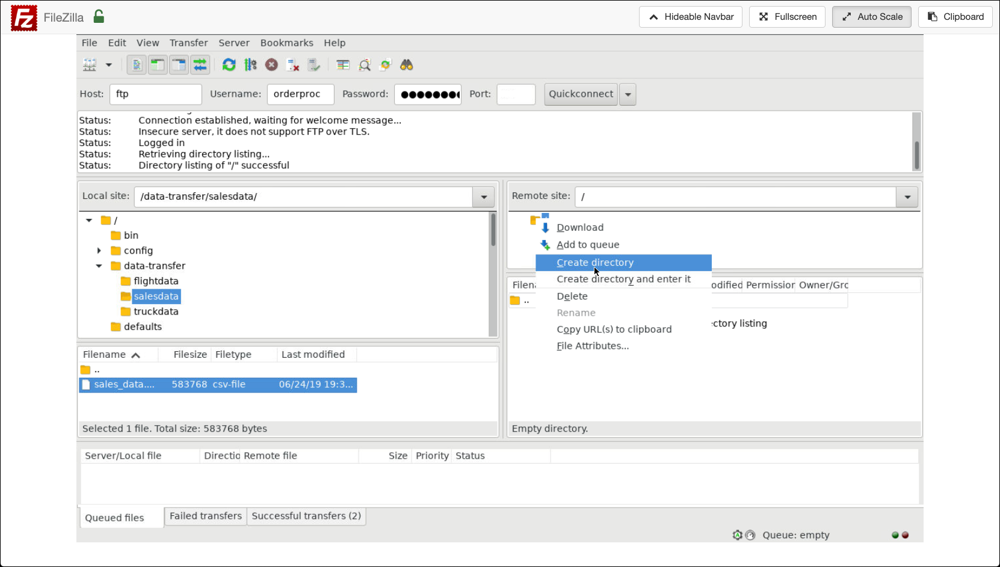
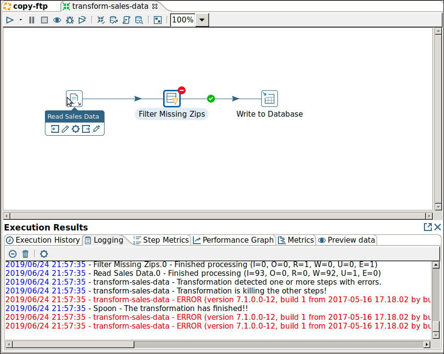

# Batch Data Movement using Penthao

The Data Integration perspective of Spoon allows you to create two basic file types: transformations and jobs. Transformations are used to describe the data flows for ETL such as reading from a source, transforming data and loading it into a target location. Jobs are used to coordinate ETL activities such as defining the flow and dependencies for what order transformations should be run, or prepare for execution by checking conditions such as, "Is my source file available?" or "Does a table exist in my database?"

This exercise will step you through building your first transformation with Pentaho Data Integration introducing common concepts along the way. The exercise scenario includes a flat file (.csv) of sales data that you will load into a database so that mailing lists can be generated. Several of the customer records are missing postal codes (zip codes) that must be resolved before loading into the database. The logic looks like this:

## Starting Penthao using a Docker Container

As Penthao is a Fat Client Application, we cannot start it as part of the Docker Compose stack. But we can also start it using a docker container and reference the network using the `--network` argument, so that we can access the different infrastructure element using the service names from the docker compose definition. 

In a terminal window, execute the following command and the Penthao splash screen should show up

```
docker run -it --rm -v /tmp/.X11-unix/:/tmp/.X11-unix/:ro \
        -v $(pwd):/jobs \
        -e XAUTH=$(xauth list|grep `uname -n` | cut -d ' ' -f5) -e "DISPLAY" \
        --network docker_default \
        --name spoon \
        andrespp/pdi spoon
```

If it doesn't work, then you can also download it to your local machine.

## Make sure that there is some data on the FTP server

Navigate to <http://integrationplatform:5800> to open the Filezilla UI in a browser window. 

1. Enter `admin123` into the **password** field and click **Submit**.
2. Enter `ftp` into the **host** field.
3. Enter `orderproc` into the **Username** field and again `orderproc` into the **Password** field. 
4. Enter `21` into the **Port** field. 

	

5. Click **Quickconnect**.
6. Create a folder on the Remote Site by right clicking on the `/` and select **Create directory** from the pop-up menu

	

7. Enter '/inbox` into the Create directory field and confirm with **OK**.
8. In the folder tree on the left below **Local site** navigate to `/data-transfer/salesdata`
9. On the **Remote site** select the **inbox** folder and then double-click on the `sales_data.csv` file on the **Local site**. 
10. A **Transfer finished** message should show up and the file should appear on the **Remote site** inside the `inbox` folder. 

The file is now available on the FTP server and we will use Penthao to first copy it locally and then process it and load it into a Postgresql database.

## Copy data from FTP Server to Local files

Follow the instructions below to retrieve a file from a FTP server. 

1. Select **File** > **New** > **Job** in the upper left corner of the Spoon window to create a new job.

	

2. Under the **Design** tab, expand the **General** node; then, select and drag a **START** step onto the canvas.

3. Again under the **Design** tab, expand the **File Transfer** node; then, select and drag a **Get a File with FTP** step onto the canvas.

	

4. Create a hop between the **START** step and the **Get a file with FTP** step. Hops are used to describe the flow of data in your transformation. To create the hop, click the **START** step, then press the **<SHIFT>** key and draw a line to the **Get a file with FTP** step.

5. Double-click on the ** Get a file with FTP** input step. The **Get a file with FTP** file input window appears.  This window allows you to set the properties for this step.

6. On the **General** tab enter `ftp` into the **FTP server name / IP address** field and `21` into the **Server port** field. Enter `orderproc` for the **Username** field and again `orderproc ` into the **Password** field. 

	

7. Navigate to the **Files** tab. 
8. Enter `/inbox` into the **Remote directory** field and click **Check folder**. 
9. Enter `.*.csv` into the **Wildcard (regular expression)** field. 
9. Select **Remove files after retrieval?**.  
9. Select **Move files after retrieval?**, enter `archive` into the **Move to folder** field and select the **Create folder**. 
10. Enter `/tmp` into the **Target directory** field. 
11. Click **OK**.

	

12. Select **File** > **Save** and enter `copy-ftp` into the **Name** field, navigate to the `root` folder and click **OK**.

13. To run the job, click on the play icon on the top of the canvas. 

	

14. On the pop-up window leave everything to default settings and click **Run**. 
15. After a few seconds you should see a **Success** log message, confirming that the copy has been done. 

	

16. Check in **Filezilla** that the **sales_data.csv** has been removed and moved to the **archive** folder. 

	

17. Now also check that the file has been copied to the `/tmp` folder inside the **spoon** container

```
docker exec -ti spoon ls /tmp/sales_data.csv
```

## Retrieving Data from a Flat File

Follow the instructions below to retrieve data from a flat file. 

1. Select **File** > **New** > **Transformation** in the upper left corner of the Spoon window to create a new transformation.

2. Under the **Design** tab, expand the **Input** node; then, select and drag a **Text File Input** step onto the canvas.

3. Double-click on the **Text File** input step. The **Text file input** window appears. This window allows you to set the properties for this step.

	

4. Enter `Read Sales Data` into the **Step Name** field. This renames the **Text file input** step to **Read Sales Data**.

5. Click **Browse** on the right of the **File or directory** field to locate the source file we have copied above from the FTP server, **sales_data.csv**, available under `/tmp/`. Select the file and click **OK** and the path to the source file appears in the **File or directory** field.

6. Click **Add**. The path to the file appears under **Selected Files**. 

7. To look at the contents of the file perform the following steps:

   * Click the **Content** tab, then set the **Format** field to `Unix​`.  
   * Click the **File** tab again and click the **Show file content** near the bottom of the window.  
   * The **Number of lines** to view window appears.  Click the **OK** button to accept the default.
   * The **Content of first file** window displays the file.  Examine the file to see how that input file is delimited, what enclosure character is used, and whether or not a header row is present. In the sample, the input file is comma (,) delimited, the enclosure character being a quotation mark (“) and it contains a single header row containing field names.
   * Click on **Close** to close the window.

8. To provide information about the content, perform the following steps:
   * Click again on **Content** tab. The fields under the Content tab allow you to define how your data is formatted.
   * Make sure that the **Separator** is set to comma `,` and that the **Enclosure** is set to quotation mark `"`. Enable **Header** because there is one line of header rows in the file.

	

   * Navigate to the **Fields** tab and click **Get Fields** to retrieve the input fields from your source file. When the **Nr of lines to sample ...** window appears, enter `0` in the field to read all the rows and then click **OK**.
   * if the **Scan Result** window displays, click **Close** to close the window.
   * To verify that the data is being read correctly:
      
      * Click the **Content** tab, then click **Preview Rows**.
      * In the **Enter preview size** window click **OK**.  The Examine preview data window appears.  
      * Review the data, then click **Close**.
    
   * Click **OK** to save the information that you entered in the step.
   
   * To save the transformation, do these things.
      
      * Select **File** | **Save** to save the transformation.
      * Enter `transform-sales-data` into the **Name** field and select the `root` folder. 
      * Click **OK** to save the transformation and close the window. 

## Filter Records with Missing Postal Codes

After completing **Retrieve Data from a Flat File**, you are ready to add the next step to your transformation. The source file contains several records that are missing postal codes. Use the Filter Rows transformation step to separate out those records so that you can resolve them in a later exercise.

  1. Add a **Filter Rows** step to your transformation. Under the **Design** tab, select **Flow** > **Filter Rows**.
  2. Create a hop between the **Read Sales Data** step and the **Filter Rows** step. Hops are used to describe the flow of data in your transformation. To create the hop, click the Read **Sales Data** (Text File input) step, then press the **SHIFT** key down and draw a line to the **Filter Rows** step.
  3. Double-click the **Filter Rows** step and the **Filter Rows** property window appears.
  4. Enter `Filter Missing Zips` into the **Step Name** field.
  5. Under **The condition**, click **<field>**.
  6. In the **Fields** window select `POSTALCODE` and click **OK**.
  7. Click on the comparison operator (set to `=` by default) and select the `IS NOT NULL` from the **Functions:** window that appears.
  8. Click **OK​** to close the Functions: window.
  9. Click **OK** to exit the Filter Rows window.

**Note**: You will return to this step later and configure the Send true data to step and Send false data to step settings after adding their target steps to your transformation.

Select **File** | **Save** to save your transformation.

## Loading Your Data into a Relational Database

After completing **Filter Records with Missing Postal Codes**, you are ready to take all records exiting the **Filter rows** step where the **POSTALCODE** was not null (the **true** condition), and load them into a database table.

  1. Under the **Design** tab, expand the contents of the **Output** node.
  2. Click and drag a **Table Output** step into your transformation. Create a hop between the **Filter Missing Zips** and **Table Output** steps. In the dialog that appears, select **Result is TRUE**.
  3. Double-click the **Table Output** step to open its edit properties dialog box.
  4. Enter `Write to Database` into the **Step Name** field.
  5. Click **New** next to the **Connection** field. You must create a connection to the database. The **Database Connection** dialog box appears.
  6. In the **Connection Type** list box, select the **PostreSQL** database.
  7. Enter `Postgres` into the **Connection Name** field. 
  7. Enter `postgresql` into the **Host Name** field.
  8. Enter `orderproc` into the **Database Name** field.
  9. Enter `orderproc` into the **User Name** field and again `orderproc` into the **Password** field. 
  10. Click **Test** to see if the connection is working. A message saying "Connection to database [Postgres] is OK" should appear!
  11. Click **OK** to close the popup window and then again **OK** to close the **Database Connection** dialog box.
  9. Enter `SALES_DATA` into the **Target Table** field.
 10. Since this table does not exist in the target database, you will need use the software to generate the Data Definition Language (DDL) to create the table and execute it. DDLs are the SQL commands that define the different structures in a database such as CREATE TABLE.

     * In the **Table Output** window, enable the **Truncate Table** property.
     * Click the **SQL** button at the bottom of the **Table output** dialog box to generate the DDL for creating your target table.
     * The **Simple SQL** editor window appears with the SQL statements needed to create the table.

     * 

     * Click **Execute** to execute the SQL statement.  
     * The Results of the SQL statements window appears.  Examine the results, then click **OK** to close the **Results of the SQL statements** window.  
     * Click **Close** in the **Simple SQL editor** window to close it.
     * Click **OK** to close the **Table output** window.

Save your transformation.

## Run Your Transformation

Data Integration provides a number of deployment options. Running a Transformation explains these and other options available for execution. This final part of this exercise to create a transformation focuses exclusively on the Local run option.

1. In the PDI client window, select **Action** | **Run**.

2. The Run Options window appears. Keep the default `Pentaho local` option for this exercise. It will use the native Pentaho engine and run the transformation on your local machine.
3. Click **Run**. The transformation executes. Upon running the transformation, the Execution Results panel opens below the canvas.

4. The **Execution Results** section of the window contains several different tabs that help you to see how the transformation executed, pinpoint errors, and monitor performance.

  * **Step Metrics** tab provides statistics for each step in your transformation including how many records were read, written, caused an error, processing speed (rows per second) and more.  This tab also indicates whether an error occurred in a transformation step.  We did not intentionally put any errors in this tutorial so it should run correctly.  But, if a mistake had occurred, steps that caused the transformation to fail would be highlighted in red.  In the example below, the Lookup Missing Zips step caused an error.

	

  * **The Logging** tab displays the logging details for the most recent execution of the transformation. It also allows you to drill deeper to determine where errors occur.  Error lines are highlighted in red.  In the example below, the **Lookup Missing Zips** step caused an error because it attempted to lookup values on a field called `POSTALCODE2`, which did not exist in the lookup stream. 

	
