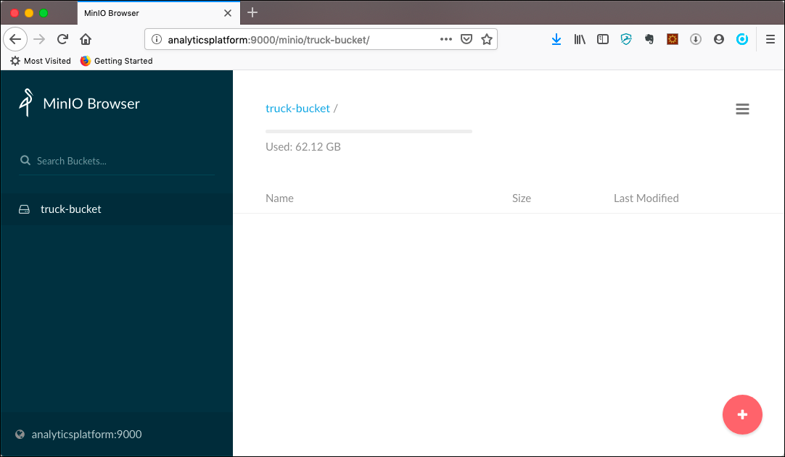
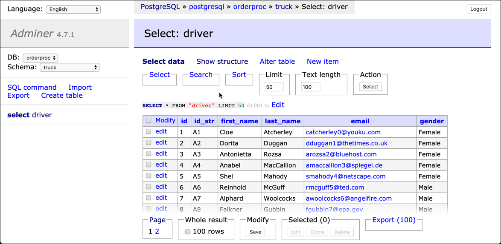

# Data Virtualisation with Presto

In this workshop we will work with [Starburst Presto](https://www.starburstdata.com/) and [Dremio](http://dremio.com) to play with **Data Virtualisation**. 

We will access the data from both PostgreSQL Database as well as Object Storage, which can either be [MinIO](https://min.io/) as shown in the workshop, [Amazon S3](https://aws.amazon.com/s3/) or any other cloud Object Storage solution. 

We assume that the **Data platform** described [here](../01-environment) is running and accessible. 

The data needed for this workshop are available in the `data-transfer` folder.


The connection of Presto to object storage is held in the [`minio.properties`](../01-environment/docker/conf/presto/minio.properties) file and contains the following settings: 

```
connector.name=hive-hadoop2
hive.metastore.uri=thrift://hive-metastore:9083
hive.s3.path-style-access=true
hive.s3.endpoint=http://minio:9000
hive.s3.aws-access-key=V42FCGRVMK24JJ8DHUYG
hive.s3.aws-secret-key=bKhWxVF3kQoLY9kFmt91l+tDrEoZjqnWXzY9Eza
hive.non-managed-table-writes-enabled=true
hive.s3.ssl.enabled=false
```

The connection of Presto to Postgresql is held in the [`postgresql.properties`](../01-environment/docker/conf/presto/postgresql.properties) file and contains the following settings: 

```
connector.name=postgresql
connection-url=jdbc:postgresql://postgresql:5432/sample
connection-user=sample
connection-password=sample
```

## Preparing test data in MinIO and PostgreSQL

First let's create the necessary data in MinIO and PostgreSQL. We first upload some files to Object Storage and register its metadata in Hive Metastore, so that the data is available in form of tables queryable through SQL.

### Working with MinIO

[MinIO](https://min.io/) is an object storage server released under Apache License v2.0. It is compatible with Amazon S3 cloud storage service. It is best suited for storing unstructured data such as photos, videos, log files, backups and container / VM images. Size of an object can range from a few KBs to a maximum of 5TB.

There are various ways for accessing MinIO

 * **S3cmd** - a command line S3 client for working with S3 compliant object stores
 * **MinIO UI** - a browser based GUI for working with MinIO
 * **Apache Zeppelin** - a browser based GUI for working with various tools needed in a modern Data platform

These are only a few of the tools available to work with S3. And because an Object Store is in fact a drop-in replacement for HDFS, we can also use it from the tools in the Big Data ecosystem such as Hadoop Hive, Spark, ...

#### Using S3cmd

[S3cmd](https://s3tools.org/s3cmd) is a command line utility for working with S3. 

In our environment, S3cmd is accessible inside the `awscli` as well as the `zeppelin` container.  

Running `s3cmd -h` will show the help page of s3cmd.

```
docker exec -ti awscli s3cmd -h
```

This can also be found on the [S3cmd usage page](https://s3tools.org/usage).

#### Using MinIO UI

In a browser window, navigate to <http://dataplatform:9000> and you should see login screen. Enter `V42FCGRVMK24JJ8DHUYG` into the **Access Key** and  `bKhWxVF3kQoLY9kFmt91l+tDrEoZjqnWXzY9Eza ` into the **Secret Key** field and click on the connect button.  

The MinIO homepage should now appear.
 


Click on the **+** icon at the lower right corner to either perform an **Create bucket** or **Upload file** action.


#### Using Apache Zeppelin

In a browser window, navigate to <http://dataplatform:28080> and you should see the Apache Zeppelin homepage. 

Now you need to login by clicking on the **Login** button in the top right corner. Enter `admin` into the **User Name** field and `abc123` into the **Password** field. 

Create a new notebook using the **Create new note** link and then  use the `s3cmd` command from within a cell in a notebook using the `%sh` interpreter.


### Moving data to MinIO

Let's upload the files of the Hive workshop to the object storage. 

Before we can upload anything, we have to create a bucket.

#### Create a Bucket

To create a bucket using the **S3cmd** on the command line, use the following command

```
docker exec -ti awscli s3cmd mb s3://truck-bucket
```

and you should get the bucket created method as shown below

```
bigdata@bigdata:~$ docker exec -ti awscli s3cmd mb s3://truck-bucket
Bucket 's3://truck-bucket/' created
```

Navigate to the MinIO UI (<http://dataplatform:9000>) and you should see the newly created bucket in the left. 



Instead you can also use `s3cmd ls` to list all buckets.

```
docker exec -ti awscli s3cmd ls s3://
```

#### Upload two files to the bucket

To upload a file we are going to use the `s3cmd put` command.

Let's start with the file in JSON format

```
docker exec -ti awscli s3cmd put /data-transfer/truckdata/truck_mileage.json s3://truck-bucket/result/json/truck_mileage.json
```

We use the prefix `result` to separate the files from possible `raw` files.

Next let's do the same for the file in Parquet format

```
docker exec -ti awscli s3cmd put /data-transfer/truckdata/truck_mileage.parquet s3://truck-bucket/result/parquet/truck_mileage.parquet
```

Let's see the content of `truck-bucket`

```
docker exec -ti awscli s3cmd ls s3://truck-bucket/
```

we only get content of one level depth, which is not very helpful

```
bigdata@bigdata:~/integration-architecture-workshop/01-environment/docker$ docker exec -ti awscli s3cmd ls s3://truck-bucket/
                       DIR   s3://truck-bucket/result/
```

We can do it recursively using the `-r` option

```
docker exec -ti awscli s3cmd ls -r  s3://truck-bucket/
```

and we should get a result similar to the one shown below

```
bigdata@bigdata:~/hadoop-workshop/01-environment/docker$ docker exec -ti awscli s3cmd ls -r s3://truck-bucket/
2019-06-26 18:31    537544   s3://truck-bucket/result/json/truck_mileage.json
2019-06-26 18:31     76854   s3://truck-bucket/result/parquet/truck_mileage.parquet
```

We can see the content using MinioUI.  


We have successfully uploaded the necessary files as object into the Object Storage. 

## Driver Information in PostgreSQL

A Postgresql instance called `postgresql` is available as part of the **Data platform** described [here](../01-environment).

There is already a table `driver` preloaded inside the schema `truck`. This has been done through the file [`create-driver.sql`](../01-environment/docker/sql/create-driver.sql), which is copied into the `docker-entrypoint-initdb.d` folder. The content of this folder is automatically executed upon starting the container. 

You can use the `Adminer` service to browse the data. Navigate to <http://dataplatform:28131> and log in to the `Postgresql` database using the `orderproc` database. 


Switch to the `truck` schema and you should see the `driver` table. Click on it and hit **Select Data**. 



Now let's use the provided data inside Presto. 

## Data Virtualisation with Presto

[Presto](https://prestosql.io/) is a distributed SQL query engine designed to query large data sets distributed over one or more heterogeneous data sources. Presto can natively query data in Hadoop, S3, Cassandra, MySQL, and many others, without the need for complex and error-prone processes for copying the data to a proprietary storage system. You can access data from multiple systems within a single query. For example, join historic log data stored in S3 with real-time customer data stored in MySQL. 

### Using Presto to access data in Object Storage (MinIO)

In order to access data in HDFS or S3 using Presto, we have to create a table in the Hive metastore. 

#### Create Table in Hive Metastore

Connect to Hive CLI available inside the `hive-metastore` service

```
docker exec -ti hive-metastore hive
```

On the command prompt, execute the following `CREATE TABLE` statement.

```
CREATE EXTERNAL TABLE truck_mileage 
(truckid string, driverId string, rdate string, miles integer, gas integer, mpg double) 
STORED AS parquet 
LOCATION 's3a://truck-bucket/result/parquet/'; 
```

Note that the location 's3a://truck-bucket/result/parquet' points to the data we have uploaded before.

You can directly test the mapping inside Hive:

```
SELECT *
FROM truck_mileage;
```

With the mapping in place, we can now use Presto to query the data in MinIO. 

#### Query Hive Table from Presto

Let's see that in action. Connect to the Presto CLI using

```
docker exec -it presto-1 presto-cli
```

On the Presto command prompt, first switch to the right database. 

```
use minio.default;
```

Let's see the tables available:

```
show tables;
```

We can see the `truck_mileage` table we created in the Hive Metastore before

```
presto:default> show tables;
     Table
---------------
 truck_mileage
(1 row)
```

We can use the `DESCRIBE` command to see the structure of the table

```
DESCRIBE minio.default.truck_mileage;
```

and get the following result

```
presto> DESCRIBE minio.default.truck_mileage;
  Column  |  Type   | Extra | Comment
----------+---------+-------+---------
 truckid  | varchar |       |
 driverid | varchar |       |
 rdate    | varchar |       |
 miles    | integer |       |
 gas      | integer |       |
 mpg      | double  |       |
```

And finally let's query the table 

```
SELECT * FROM truck_mileage;
```

We can execute the same query, but using a fully qualified tablename, including the database:

```
SELECT * 
FROM minio.default.truck_mileage;
```

Presto also provides the [Presto UI](http://dataplatform:28081) for monitoring the queries executed on the presto server. 

### Using Presto to access data in a Relational Database

Now let's also query the `driver` table from Postgresql using Presto. Connect to the `presto-cli`

```
docker exec -ti presto presto-cli
```

Show all the schemas available in the database

```
SHOW SCHEMAS FROM postgresql;
```

We can see the `truck` schemas created above

```
presto> SHOW SCHEMAS FROM postgresql;
       Schema       
--------------------
 information_schema 
 pg_catalog         
 public             
 truck              
(4 rows)
```

Let's see the tables in this schema

```
SHOW TABLES FROM postgresql.truck;
```

We can see the `driver` table

```
presto> SHOW TABLES FROM postgresql.truck;
 Table  
--------
 driver 
(1 row)
```

We can use the `DESCRIBE` command to get the structure of the table.

```
DESCRIBE postgresql.truck.driver;
```

```
presto> DESCRIBE postgresql.truck.driver;
   Column   |     Type     | Extra | Comment 
------------+--------------+-------+---------
 id         | integer      |       |         
 id_str     | varchar(10)  |       |         
 first_name | varchar(100) |       |         
 last_name  | varchar(100) |       |         
 email      | varchar(50)  |       |         
 gender     | varchar(10)  |       |         
(6 rows)

```

Last but not least lets see the `driver` data in Presto. 

```
SELECT * 
FROM postgresql.truck.driver;
```

### Joining Data using Presto

With the `driver` table available in the Postgresql and the `truck_mileage` available in the Object Store through Hive, we can use Presto's join capabilities to join the two tables using a `SELECT ... FROM ... LEFT JOIN` statement: 

```
SELECT d.id, d.id_str, d.first_name, d.last_name, tm.truckid, tm.miles, tm.gas 
FROM minio.default.truck_mileage AS tm
LEFT JOIN postgresql.truck.driver AS d
ON (tm.driverid = d.id_str)
WHERE rdate = 'jun13'; 
```

