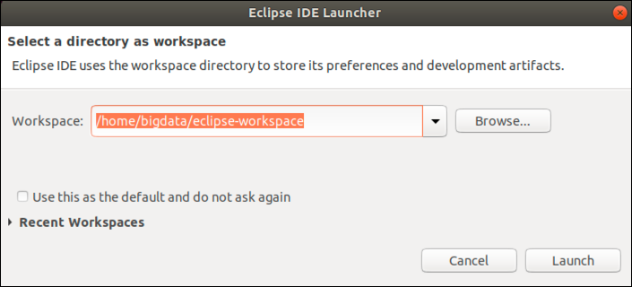
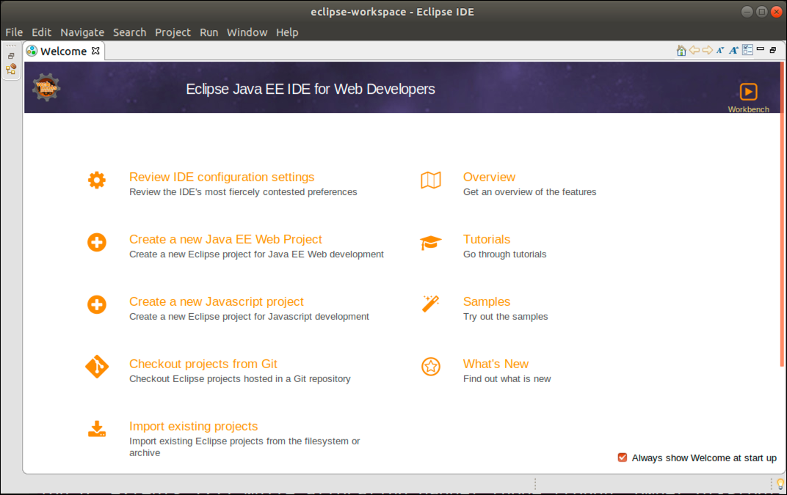
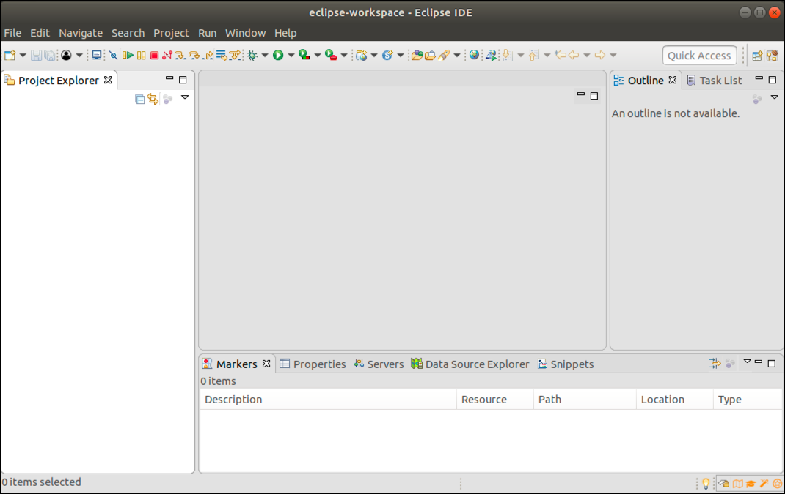
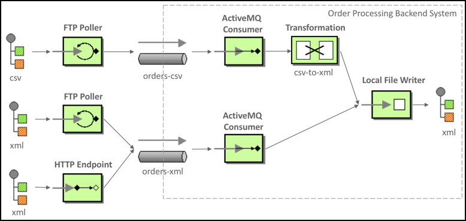
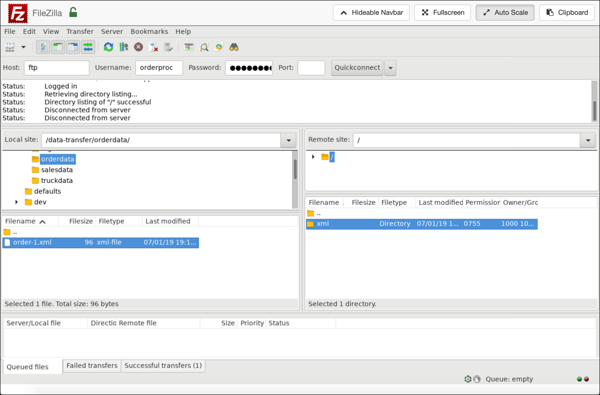
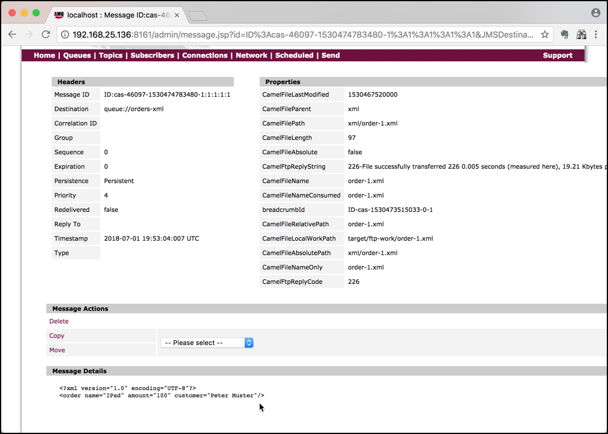
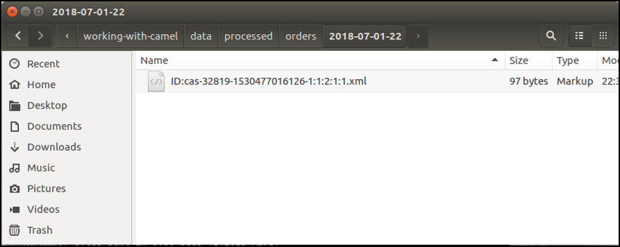

# Using Apache Camel Integration Framework

In this workshop we will learn how to use the [Apache Camel](https://camel.apache.org) Integration Framework. 

We will see how Apache Camel can help in integrating different applications/systems in a very lightweight manner. 

## Adding the necessary services to the environment

For this workshop we will use the `ftp` service which is already part of the base platform. Make sure that you update the `docker-compose.yml` to the latest version in GitHub, by executing a `git pull`. The `ftp` service should look like the one below

```
  ftp:
    image: stilliard/pure-ftpd
    container_name: ftp
    hostname: ftp
    environment:
#      - PUBLICHOST="192.168.73.86"
      - PUBLICHOST=${DOCKER_HOST_IP}
      - FTP_USER_NAME=orderproc
      - FTP_USER_PASS=orderproc
      - FTP_USER_HOME=/home/ftp-data
      - FTP_MAX_CLIENTS=9
    ports:
      - "21:21"
      - "30000-30009:30000-30009"
    restart: always
```

Additionally to the base environment, we need `activemq` & `hawtio` if not already existing from the previous workshops. Add the following services to the `docker-compose.override.yml` file 

```
  activemq:
    image: rmohr/activemq
    container_name: activemq
    ports:
      # mqtt
      - "1883:1883"
      # amqp
      - "5672:5672"
      # ui
      - "8161:8161"
      # stomp
      - "61613:61613"
      # ws
      - "61614:61614"
      # jms
      - "61616:61616"
#    volumes:
#      - ./container-volume/activemq/data:/opt/activemq/data
    restart: always
 
  hawtio:
    image: "erikwramner/hawtio"
    container_name: hawtio
    hostname: hawtio
    ports:
      - "38085:8080"
```

Additionally we also need a Java IDE to create some, rather simple Java classes, which act as the orchestrator for our Apache Camel flows. In this workshop we will use the Eclipse IDE, but you can also use your own, preferred IDE, if you have some previous experience with Java. 

Unfortunately Eclipse cannot be provisioned using Docker. You either have to install it on your local machine or use the one provided with the Virtual Machine. 

### Starting Eclipse IDE of Virtual Machine

Inside the Virtual Machine, Eclipse is available in the folder `/home/bigdata/eclipse/jee-2018-09/eclipse`. 

```
cd /home/bigdata/eclipse/jee-2018-09/eclipse
./eclipse
```

Skip the next section and continue with **Using Eclipse IDE**

### Download and Install Eclipse IDE to your local machine

Navigate to <https://www.eclipse.org/downloads/> and download the **Eclipse IDE 2019-06** package. Install it to either your Windows, Mac or Linux environment. 

On installing Eclipse IDE you will get asked for the flavour of Eclipse you want to install. Select **Eclipse IDE for Java Developers** when asked and click **Install**. Accept the **Eclipse Foundation Software User Agreement** by clicking on **Accept Now**. During installation you might again be asked to accept license terms. Select **Remember accepted licenses** and click **ACCEPT**. 

Once installed, click on the Eclipse IDE icon and follow with the next section

### Using Eclipse IDE

After starting Eclipse through either the command line or by clicking on the icon, you should  get the **Eclipse IDE Launcher** similar to the screenshot below



Change the **Workspace** folder according to your needs and click **Launch**.

After while, you should see the **Eclipse IDE Home** similar to the screenshot below



Click on the **Workbench** Icon in the top right corner to navigate to the **Eclipse IDE** view. 



This is the view you will use to work with Java artefacts.

## Create a new Java/Maven project and configure it (pom.xml)

Create a new [Maven project](../99-misc/97-working-with-eclipse/README.md) and in the last step use `com.integration.ws` for the **Group Id** and `working-with-camel` for the **Artifact Id**. Leave the **Version** and **Packaging** as is and click **Finish**.

Navigate into the `working-with-camel` project by expanding the tree on the left and double-click on the **pom.xml**. This will open the POM Editor in the middle of the IDE. 

You can either use the GUI editor to change the `pom.xml` or click on the last tab **pom.xml** to switch to the "code view". Let's do that. 

You will see the still rather empty definition.

```
<project xmlns="http://maven.apache.org/POM/4.0.0" xmlns:xsi="http://www.w3.org/2001/XMLSchema-instance" xsi:schemaLocation="http://maven.apache.org/POM/4.0.0 http://maven.apache.org/xsd/maven-4.0.0.xsd">
  <modelVersion>4.0.0</modelVersion>
  <groupId>com.integrationws</groupId>
  <artifactId>working-with-camel</artifactId>
  <version>0.0.1-SNAPSHOT</version>
</project>
```

Let's add some initial dependencies for the project. Dependencies in Maven are links to external Java projects needed to build an application. Instead of manually downloading and provisioning these libraries, we only have to provide the exact name and version and Maven will do the downloading for us. 

Copy the following block right after the <version> tag, before the closing </project> tag.

```
   <properties>
		<activemq-version>5.15.4</activemq-version>
		<camel-version>2.24.1</camel-version>
		<spring-version>4.1.7.RELEASE</spring-version>
		<slf4j-version>1.7.5</slf4j-version>

		<!-- use utf-8 encoding -->
		<project.build.sourceEncoding>UTF-8</project.build.sourceEncoding>
		<project.reporting.outputEncoding>UTF-8</project.reporting.outputEncoding>
    </properties>

    <dependencies>
		<dependency>
			<groupId>org.apache.camel</groupId>
			<artifactId>camel-core</artifactId>
			<version>${camel-version}</version>
		</dependency>

		<dependency>
			<groupId>org.apache.camel</groupId>
			<artifactId>camel-spring</artifactId>
			<version>${camel-version}</version>
		</dependency>

		<dependency>
		    <groupId>org.slf4j</groupId>
		    <artifactId>slf4j-log4j12</artifactId>
		    <version>${slf4j-version}</version>
		</dependency>
    </dependencies>
    
	<build>
		<defaultGoal>install</defaultGoal>

		<pluginManagement>
			<plugins>
				<plugin>
					<groupId>org.apache.maven.plugins</groupId>
					<artifactId>maven-compiler-plugin</artifactId>
					<version>2.5</version>
					<configuration>
						<source>1.7</source>
						<target>1.7</target>
						<maxmem>256M</maxmem>
						<showDeprecation>true</showDeprecation>
					</configuration>
				</plugin>
				<plugin>
					<groupId>org.codehaus.mojo</groupId>
					<artifactId>exec-maven-plugin</artifactId>
					<version>1.1.1</version>
				</plugin>
				<plugin>
					<groupId>org.apache.camel</groupId>
					<artifactId>camel-maven-plugin</artifactId>
					<version>${camel-version}</version>
				</plugin>
			</plugins>
		</pluginManagement>
	</build>    
```

We will add some more dependencies to the POM throughout this workshop.

Saving the `pom.xml` will refresh the Eclipse project settings and download the necessary artefacts from the maven repository.

Refresh the project in Eclipse to re-read the project settings.

### Create log4j settings

Let's also create the necessary log4j configuration. 

In the code we are using the [Log4J Logging Framework](https://logging.apache.org/log4j/2.x/), which we have to configure using a property file. 

Create a new file `log4j.properties` in the folder **src/main/resources** and add the following configuration properties. 

```
## ------------------------------------------------------------------------
## Licensed to the Apache Software Foundation (ASF) under one or more
## contributor license agreements.  See the NOTICE file distributed with
## this work for additional information regarding copyright ownership.
## The ASF licenses this file to You under the Apache License, Version 2.0
## (the "License"); you may not use this file except in compliance with
## the License.  You may obtain a copy of the License at
##
## http://www.apache.org/licenses/LICENSE-2.0
##
## Unless required by applicable law or agreed to in writing, software
## distributed under the License is distributed on an "AS IS" BASIS,
## WITHOUT WARRANTIES OR CONDITIONS OF ANY KIND, either express or implied.
## See the License for the specific language governing permissions and
## limitations under the License.
## ------------------------------------------------------------------------

#
# The logging properties used for eclipse testing, We want to see INFO output on the console.
#
log4j.rootLogger=INFO, out

#log4j.logger.org.apache.activemq=DEBUG

# uncomment the next line to debug Camel
log4j.logger.org.apache.camel=DEBUG

log4j.logger.org.apache.camel.impl.converter=INFO
log4j.logger.org.apache.camel.util.ResolverUtil=INFO

log4j.logger.org.springframework=WARN
log4j.logger.org.hibernate=WARN

# CONSOLE appender not used by default
log4j.appender.out=org.apache.log4j.ConsoleAppender
log4j.appender.out.layout=org.apache.log4j.PatternLayout
log4j.appender.out.layout.ConversionPattern=[%30.30t] %-30.30c{1} %-5p %m%n
#log4j.appender.out.layout.ConversionPattern=%d [%-15.15t] %-5p %-30.30c{1} - %m%n

log4j.throwableRenderer=org.apache.log4j.EnhancedThrowableRenderer
```

This finishes the **setup steps** and our new project is ready to be used. We will start with a simple flow using **Apache Camel**. 

## Create simple Apache Camel flow using the File component

Let's start with a simple File-based data flow. 

We will be **reading files** from a **local folder** and **store it** in another **local folder**. We will show it both using the Spring DSL as well as the Java DSL of Apache Camel. 

First let's implement it using the Java DSL

### Using the Java DSL

First create a new Java Package `com.integrationws.camel` in the folder **src/main/java**.

Create a new Java Class `FileCopierJava` in the package `com.integrationws.camel` just created. 

Add the following code to the empty class. 

``` 
package com.integrationws.camel;

import org.apache.camel.builder.RouteBuilder;
import org.apache.camel.main.Main;

public class FileCopierJava {

    public static void main(String args[]) throws Exception {

    	 Main main = new Main();

        // add our route to the CamelContext
        main.addRouteBuilder(new RouteBuilder() {
            public void configure() {
                from("file:data/inbox?delay=5s")
                .to("file:data/outbox");
            }
        });

        // run the route and let it do its work
        main.run();
    }
}
``` 

We can see that the Java DSL is used inside a public static main method. It uses the `from()` to specify from where to read and the `to()` to specify where to write the messages to. 

Right click on the class in the **Package Explorer** and select **Run As** | **Java Application** to start and run our first Apache Camel application. 


The Java application will start the Camel route and the you should see in the console output window that the [File](http://camel.apache.org/file2.html) component is starting to poll from the `data/inbox` folder.

```
[el Thread #1 - LRUCacheFactory] LRUCacheFactory                DEBUG Warming up LRUCache ...
[el Thread #1 - LRUCacheFactory] LRUCacheFactory                DEBUG Warming up LRUCache complete in 603 millis
[                          main] DefaultCamelContext            DEBUG Adding routes from builder: Routes: []
[                          main] DefaultCamelContext            INFO  Apache Camel 2.24.1 (CamelContext: camel-1) is starting
[                          main] DefaultCamelContext            DEBUG Using ClassResolver=org.apache.camel.impl.DefaultClassResolver@66a3ffec, PackageScanClassResolver=org.apache.camel.impl.DefaultPackageScanClassResolver@77caeb3e, ApplicationContextClassLoader=null, RouteController=org.apache.camel.impl.DefaultRouteController@1e88b3c
[                          main] ManagedManagementStrategy      INFO  JMX is enabled
[                          main] DefaultManagementAgent         DEBUG Starting JMX agent on server: com.sun.jmx.mbeanserver.JmxMBeanServer@39c0f4a
[                          main] DefaultManagementAgent         DEBUG Registered MBean with ObjectName: org.apache.camel:context=camel-1,type=context,name="camel-1"
[                          main] TimerListenerManager           DEBUG Added TimerListener: org.apache.camel.management.mbean.ManagedCamelContext@710726a3
[                          main] DefaultManagementAgent         DEBUG Registered MBean with ObjectName: org.apache.camel:context=camel-1,type=health,name="camel-1"
[                          main] DefaultManagementAgent         DEBUG Registered MBean with ObjectName: org.apache.camel:context=camel-1,type=routecontrollers,name="camel-1"
[                          main] DefaultManagementAgent         DEBUG Registered MBean with ObjectName: org.apache.camel:context=camel-1,type=services,name=DefaultTypeConverter
[                          main] DefaultTypeConverter           INFO  Type converters loaded (core: 194, classpath: 1)
[                          main] ResolverHelper                 DEBUG Lookup Language with name simple in registry. Found: null
[                          main] ResolverHelper                 DEBUG Lookup Language with name simple-language in registry. Found: null
[                          main] SimpleLanguage                 DEBUG Simple language predicate/expression cache size: 1000
[                          main] DefaultManagementAgent         DEBUG Registered MBean with ObjectName: org.apache.camel:context=camel-1,type=services,name=DefaultEndpointRegistry
[                          main] DefaultManagementAgent         DEBUG Registered MBean with ObjectName: org.apache.camel:context=camel-1,type=services,name=DefaultExecutorServiceManager
[                          main] SharedProducerServicePool      DEBUG Starting service pool: org.apache.camel.impl.SharedProducerServicePool@1df82230
[                          main] aredPollingConsumerServicePool DEBUG Starting service pool: org.apache.camel.impl.SharedPollingConsumerServicePool@22635ba0
[                          main] DefaultManagementAgent         DEBUG Registered MBean with ObjectName: org.apache.camel:context=camel-1,type=services,name=DefaultInflightRepository
[                          main] DefaultManagementAgent         DEBUG Registered MBean with ObjectName: org.apache.camel:context=camel-1,type=services,name=DefaultAsyncProcessorAwaitManager
[                          main] DefaultManagementAgent         DEBUG Registered MBean with ObjectName: org.apache.camel:context=camel-1,type=services,name=DefaultShutdownStrategy
[                          main] DefaultManagementAgent         DEBUG Registered MBean with ObjectName: org.apache.camel:context=camel-1,type=services,name=DefaultRestRegistry
[                          main] DefaultManagementAgent         DEBUG Registered MBean with ObjectName: org.apache.camel:context=camel-1,type=services,name=DefaultRuntimeCamelCatalog
[                          main] DefaultManagementAgent         DEBUG Registered MBean with ObjectName: org.apache.camel:context=camel-1,type=services,name=DefaultTransformerRegistry
[                          main] DefaultManagementAgent         DEBUG Registered MBean with ObjectName: org.apache.camel:context=camel-1,type=services,name=DefaultValidatorRegistry
[                          main] DefaultCamelContext            DEBUG Using ComponentResolver: org.apache.camel.impl.DefaultComponentResolver@60d8c9b7 to resolve component with name: file
[                          main] ResolverHelper                 DEBUG Lookup Component with name file in registry. Found: null
[                          main] ResolverHelper                 DEBUG Lookup Component with name file-component in registry. Found: null
[                          main] DefaultComponentResolver       DEBUG Found component: file via type: org.apache.camel.component.file.FileComponent via: META-INF/services/org/apache/camel/component/file
[                          main] DefaultManagementAgent         DEBUG Registered MBean with ObjectName: org.apache.camel:context=camel-1,type=components,name="file"
[                          main] DefaultComponent               DEBUG Cannot resolve property placeholders on component: org.apache.camel.component.file.FileComponent@35047d03 as PropertiesComponent is not in use
[                          main] DefaultComponent               DEBUG Creating endpoint uri=[file://data/inbox?delay=5s&delete=true], path=[data/inbox]
[                          main] DefaultCamelContext            DEBUG file://data/inbox?delay=5s&delete=true converted to endpoint: file://data/inbox?delay=5s&delete=true by component: org.apache.camel.component.file.FileComponent@35047d03
[                          main] DefaultManagementAgent         DEBUG Registered MBean with ObjectName: org.apache.camel:context=camel-1,type=endpoints,name="file://data/inbox\?delay=5s&delete=true"
[                          main] DefaultComponent               DEBUG Creating endpoint uri=[file://data/outbox], path=[data/outbox]
[                          main] DefaultCamelContext            DEBUG file://data/outbox converted to endpoint: file://data/outbox by component: org.apache.camel.component.file.FileComponent@35047d03
[                          main] DefaultManagementAgent         DEBUG Registered MBean with ObjectName: org.apache.camel:context=camel-1,type=endpoints,name="file://data/outbox"
[                          main] DefaultChannel                 DEBUG Initialize channel for target: 'To[file:data/outbox]'
[                          main] DefaultManagementAgent         DEBUG Registered MBean with ObjectName: org.apache.camel:context=camel-1,type=tracer,name=BacklogTracer
[                          main] DefaultManagementAgent         DEBUG Registered MBean with ObjectName: org.apache.camel:context=camel-1,type=tracer,name=BacklogDebugger
[                          main] DefaultManagementAgent         DEBUG Registered MBean with ObjectName: org.apache.camel:context=camel-1,type=errorhandlers,name="DefaultErrorHandlerBuilder(ref:CamelDefaultErrorHandlerBuilder)"
[                          main] DefaultCamelContext            INFO  StreamCaching is not in use. If using streams then its recommended to enable stream caching. See more details at http://camel.apache.org/stream-caching.html
[                          main] HeadersMapFactoryResolver      DEBUG Creating default HeadersMapFactory
[                          main] DefaultCamelContext            DEBUG Using HeadersMapFactory: org.apache.camel.impl.DefaultHeadersMapFactory@35e2d654
[                          main] DefaultCamelContext            DEBUG Warming up route id: route1 having autoStartup=true
[                          main] RouteService                   DEBUG Starting services on route: route1
[                          main] RouteService                   DEBUG Starting child service on route: route1 -> Channel[sendTo(file://data/outbox)]
[                          main] DefaultManagementAgent         DEBUG Registered MBean with ObjectName: org.apache.camel:context=camel-1,type=producers,name=GenericFileProducer(0x1aafa419)
[                          main] ProducerCache                  DEBUG Adding to producer cache with key: file://data/outbox for producer: Producer[file://data/outbox]
[                          main] RouteService                   DEBUG Starting child service on route: route1 -> sendTo(file://data/outbox)
[                          main] DefaultManagementAgent         DEBUG Registered MBean with ObjectName: org.apache.camel:context=camel-1,type=processors,name="to1"
[                          main] RouteService                   DEBUG Starting child service on route: route1 -> Channel[sendTo(file://data/outbox)]
[                          main] DefaultManagementAgent         DEBUG Registered MBean with ObjectName: org.apache.camel:context=camel-1,type=routes,name="route1"
[                          main] TimerListenerManager           DEBUG Added TimerListener: org.apache.camel.management.mbean.ManagedSuspendableRoute@459e9125
[                          main] ultManagementLifecycleStrategy DEBUG Load performance statistics disabled
[                          main] GenericFileProducer            DEBUG Starting producer: Producer[file://data/outbox]
[                          main] DefaultCamelContext            DEBUG Route: route1 >>> EventDrivenConsumerRoute[file://data/inbox?delay=5s&delete=true -> Channel[sendTo(file://data/outbox)]]
[                          main] DefaultCamelContext            DEBUG Starting consumer (order: 1000) on route: route1
[                          main] DefaultManagementAgent         DEBUG Registered MBean with ObjectName: org.apache.camel:context=camel-1,type=consumers,name=FileConsumer(0x2a4fb17b)
[                          main] FileConsumer                   DEBUG Starting consumer: Consumer[file://data/inbox?delay=5s&delete=true]
[                          main] DefaultManagementAgent         DEBUG Registered MBean with ObjectName: org.apache.camel:context=camel-1,type=threadpools,name="FileConsumer(0x2a4fb17b)"
[                          main] DefaultExecutorServiceManager  DEBUG Created new ScheduledThreadPool for source: Consumer[file://data/inbox?delay=5s&delete=true] with name: file://data/inbox?delay=5s&delete=true -> org.apache.camel.util.concurrent.SizedScheduledExecutorService@79d8407f[file://data/inbox?delay=5s&delete=true]
[                          main] ScheduledPollConsumerScheduler DEBUG Scheduling poll (fixed delay) with initialDelay: 1000, delay: 5000 (milliseconds) for: file://data/inbox?delay=5s&delete=true
[                          main] DefaultCamelContext            INFO  Route: route1 started and consuming from: file://data/inbox?delay=5s&delete=true
[                          main] DefaultCamelContext            INFO  Total 1 routes, of which 1 are started
[                          main] DefaultCamelContext            INFO  Apache Camel 2.21.1 (CamelContext: camel-1) started in 8.790 seconds
[ thread #2 - file://data/inbox] FileEndpoint                   DEBUG Parameters for Generic file process strategy {readLockDeleteOrphanLockFiles=true, readLockRemoveOnRollback=true, readLockCheckInterval=1000, readLock=none, readLockRemoveOnCommit=false, readLockTimeout=10000, readLockMarkerFile=true, delete=true, readLockLoggingLevel=DEBUG, readLockMinAge=0, readLockMinLength=1}
[ thread #2 - file://data/inbox] FileEndpoint                   DEBUG Using Generic file process strategy: org.apache.camel.component.file.strategy.GenericFileDeleteProcessStrategy@25f6ca72
[ thread #2 - file://data/inbox] FileConsumer                   DEBUG Took 0.016 seconds to poll: data/inbox
[ thread #2 - file://data/inbox] FileConsumer                   DEBUG Took 0.001 seconds to poll: data/inbox
[ thread #2 - file://data/inbox] FileConsumer                   DEBUG Took 0.000 seconds to poll: data/inbox
[ thread #2 - file://data/inbox] FileConsumer                   DEBUG Took 0.001 seconds to poll: data/inbox
```

The `data/inbox` folder is local to our Java project, so you should find it as a subfolder below the `working-with-camel` folder in the Eclipse workspace.

Copy a file into the `data/inbox` folder, you can just take the `pom.xml` file, and you should see some other output lines in the console window, confirming that the file has been copied. 

```
[ thread #2 - file://data/inbox] FileConsumer                   DEBUG Total 1 files to consume
[ thread #2 - file://data/inbox] FileConsumer                   DEBUG About to process file: GenericFile[pom.xml] using exchange: Exchange[]
[ thread #2 - file://data/inbox] SendProcessor                  DEBUG >>>> file://data/outbox Exchange[ID-ubuntu-1561916263591-0-1]
[ thread #2 - file://data/inbox] GenericFileProducer            DEBUG Wrote [data/outbox/pom.xml] to [file://data/outbox]
[ thread #2 - file://data/inbox] GenericFileOnCompletion        DEBUG Done processing file: GenericFile[pom.xml] using exchange: Exchange[ID-ubuntu-1561916263591-0-1]
[ thread #2 - file://data/inbox] nericFileRenameProcessStrategy DEBUG Renaming file: GenericFile[pom.xml] to: GenericFile[.camel/pom.xml]
[ thread #2 - file://data/inbox] FileUtil                       DEBUG Tried 1 to rename file: /home/bigdata/eclipse-workspace/working-with-camel/data/inbox/pom.xml to: data/inbox/.camel/pom.xml with result: true
[ thread #2 - file://data/inbox] FileConsumer                   DEBUG Took 0.001 seconds to poll: data/inbox
```

Check that the file has been copied to the `data/outbox` folder. After the file is consumed, it is deleted from the `inbox` folder. 

That finishes our first, very simple Camel flow. Stop the Java application and cleanup the `data/outbox` folder by deleting the file you have just copied. 

Next let's create the same flow but using the Spring DSL. 

## Using the Spring DSL

Create a new xml file `camel-context.xml` in the resource folder `src/main/resources`. To do that, in the **Package Explorer** right-click on the folder `src/main/resources` and select **New** | **Other** and find **File** under **General** and click **Next**. Enter `camel-context.xml` into the **File name** field and click **Finish**.

The new file will open in the editor in the middle of the IDE. Navigate to the **Source** tab and add the following XML definition to the empty file.  

```
<?xml version="1.0" encoding="UTF-8"?>
<beans xmlns="http://www.springframework.org/schema/beans"
	xmlns:xsi="http://www.w3.org/2001/XMLSchema-instance"
	xmlns:broker="http://activemq.apache.org/schema/core"
	xsi:schemaLocation="
       http://www.springframework.org/schema/beans http://www.springframework.org/schema/beans/spring-beans.xsd
       http://activemq.apache.org/schema/core http://activemq.apache.org/schema/core/activemq-core.xsd
       http://camel.apache.org/schema/spring http://camel.apache.org/schema/spring/camel-spring.xsd">
	<camelContext
		xmlns="http://camel.apache.org/schema/spring">
		<route>
			<from uri="file:data/inbox?delay=5s" />
			<to uri="file:data/outbox" />
		</route>
	</camelContext>
</beans>
```

We can see a similar from -> to route than with Java DSL, but this time using XML elements. 

Create a new Java Class `FileCopierSpring` in the package `com.integrationws.camel` next to the class `FileCopierJava` we have created above. 

Add the following code to the empty class. 

```
package com.integrationws.camel;

import org.apache.camel.spring.Main;

public class FileCopierSpring {
	public static void main(String... args) throws Exception {
		Main camel = new Main();
		camel.enableHangupSupport();
		camel.setApplicationContextUri("classpath:camel-context.xml");
		camel.run(args);
	}

}
```

Right click on the class in **Package Explorer** and select **Run As** | **Java Application** to run the application. 


The Java application will start the Camel route and the you should again see in the console output window that the [File](http://camel.apache.org/file2.html) component is starting to poll from same `data/inbox` folder as before.

Copy another file to the `data/inbox` folder and then check that it has been moved to `data/outbox` folder by Apache Camel.

Stop the application and cleanup the `data/outbox` folder by deleting the file you have just copied. 

We have implemented the same, simple Camel flow also using the Spring DSL. 

After taking our first steps with Apache Camel, let's now implement a more practical use case. 

## Create the Order Management Data Flow using Camel

The following diagram shows the data flow we are going to implement in a step-wise manner. 
It's an order management flow, where orders are processed in the backend by a legacy system, which we are integrating with other systems using both Files as well as a HTTP service. 



As you can see, there are two different file formats, **CSV** and **XML**. 

The XML is the same one we will write to the local file system at the end of the data flow. The HTTP service will also accept that same XML format. 

But in the case of the CSV format, we have to transform it to XML inside the data flow. 

The FTP server we will use to get the files is already part of the base environment of the **Integration Platform**.

Let's start implementing the data flow. We will be using a combination of a Spring context for registering some beans and of using the Java DSL to define the Camel pipeline. 

### Read XML data from FTP Server and send to ActiveMQ

We will start with the XML data sources and implement the FTP source on the left hand side, polling it for new files and sending it to an Active MQ queue. 

For that we will create a new Java application. It will be similar to the one we have seen in the Spring DSL example above. 

But before that, let's first add some more dependencies to the Maven project definition. Double-click on the `pom.xml` file and navigate to the **pom.xml** tab. 

Add the following dependencies just after the `camel-spring` dependency.

```
		<dependency>
			<groupId>org.apache.camel</groupId>
			<artifactId>camel-ftp</artifactId>
			<version>${camel-version}</version>
		</dependency>

		<dependency>
			<groupId>org.apache.camel</groupId>
			<artifactId>camel-jetty</artifactId>
			<version>${camel-version}</version>
		</dependency>

		<dependency>
			<groupId>org.apache.camel</groupId>
			<artifactId>camel-bindy</artifactId>
			<version>${camel-version}</version>
		</dependency>

		<dependency>
			<groupId>org.apache.camel</groupId>
			<artifactId>camel-jaxb</artifactId>
			<version>${camel-version}</version>
		</dependency>

		<dependency>
			<groupId>org.apache.camel</groupId>
			<artifactId>camel-jms</artifactId>
			<version>${camel-version}</version>
		</dependency>

		<dependency>
			<groupId>org.apache.activemq</groupId>
			<artifactId>activemq-camel</artifactId>
			<version>${activemq-version}</version>
		</dependency>
```

These are all further dependencies to modules of Apache Camel for working with FTP, HTTP, ActiveMQ and CSV and XML formats.

Saving the `pom.xml` will refresh the Eclipse project settings and download the necessary artefacts from the maven repository.

Create a new Java Class `OrderManagementApplication` in the package `com.integrationws.camel` just next to the classes created before and add the following code.  

```
package com.integrationws.camel;

import org.apache.camel.spring.Main;

public class OrderManagementApplication {

    public static void main(String args[]) throws Exception {
        // create CamelContext
    	Main main = new Main();
		main.setApplicationContextUri("classpath:camel-order-management-context.xml");

		main.run(args);
    	
    }
}
```

As we can see, it references a `camel-order-management-context.xml` file. Create this file in the folder `src/main/resources` and add the following XML definition:

```
<?xml version="1.0" encoding="UTF-8"?>
<beans xmlns="http://www.springframework.org/schema/beans"
	xmlns:xsi="http://www.w3.org/2001/XMLSchema-instance"
	xmlns:broker="http://activemq.apache.org/schema/core"
	xsi:schemaLocation="
       http://www.springframework.org/schema/beans http://www.springframework.org/schema/beans/spring-beans.xsd
       http://activemq.apache.org/schema/core http://activemq.apache.org/schema/core/activemq-core.xsd
       http://camel.apache.org/schema/spring http://camel.apache.org/schema/spring/camel-spring.xsd">


	<camelContext xmlns="http://camel.apache.org/schema/spring">
  		<routeBuilder ref="orderManagementRouteBuilder" />    
	</camelContext>

	<bean id="orderManagmentRouteBuilder" class="com.integrationws.camel.OrderManagementRoute"/>

	<bean id="activemq"
		class="org.apache.activemq.camel.component.ActiveMQComponent">
		<property name="brokerURL" value="tcp://integrationplatform:61616" />
	</bean>

</beans>
```

It defines the `activemq` bean, which will be used to produce and consume to/from ActiveMQ. Make sure that `integrationplatform` has been added to the `/etc/hosts` file and points to the Docker host. 

Additionally we also register a Route Builder as a bean, and reference it in the `camelConext`. This route builder defines the Camel route using the Java DSL, instead of defining it using the Spring DSL. 

So let's also create the `OrderManagementRoute` Java class. It is a class which extends the Camel `RouteBuilder` class. 

```
package com.integrationws.camel;

import org.apache.camel.builder.RouteBuilder;
import org.apache.camel.model.dataformat.BindyType;

public class OrderManagementRoute extends RouteBuilder {

	@Override
	public void configure() throws Exception {
		
		/*
		 * Consume XML file from FTP server from the "xml" folder and send it to the "orders-xml" queue
		 */
        from("ftp://integrationplatform:21/xml?autoCreate=true&username=orderproc&password=orderproc&passiveMode=true&binary=false" + 
        		"&localWorkDirectory=target/ftp-work&delay=15s&delete=true")
        	.to("activemq:orders-xml");

	}
}
```

You can se that we are using some new components

  * the [ftp](http://camel.apache.org/ftp2.html) component for polling the FTP server
  * the [activemq](http://camel.apache.org/activemq.html) for producing and later also consuming to/from ActiveMQ 

Run the Java application again by right-clicking on the `OrderManagementRoute` class to see the initial data flow implementation in action. 

You should see the following output on the console window. 

```
[                          main] CamelNamespaceHandler          DEBUG Using org.apache.camel.spring.CamelContextFactoryBean as CamelContextBeanDefinitionParser
[                          main] CamelNamespaceHandler          DEBUG Registered default: org.apache.camel.spring.CamelProducerTemplateFactoryBean with id: template on camel context: camel-1
[                          main] CamelNamespaceHandler          DEBUG Registered default: org.apache.camel.spring.CamelFluentProducerTemplateFactoryBean with id: fluentTemplate on camel context: camel-1
[                          main] CamelNamespaceHandler          DEBUG Registered default: org.apache.camel.spring.CamelConsumerTemplateFactoryBean with id: consumerTemplate on camel context: camel-1
[el Thread #1 - LRUCacheFactory] LRUCacheFactory                DEBUG Warming up LRUCache ...
[                          main] SpringCamelContext             DEBUG Set the application context classloader to: sun.misc.Launcher$AppClassLoader@14ae5a5
[el Thread #1 - LRUCacheFactory] LRUCacheFactory                DEBUG Warming up LRUCache complete in 364 millis
[                          main] CamelContextFactoryBean        DEBUG afterPropertiesSet() took 707 millis
[                          main] bstractCamelContextFactoryBean DEBUG Setting up routes
[                          main] bstractCamelContextFactoryBean DEBUG Found JAXB created routes: []
[                          main] SpringCamelContext             DEBUG Adding routes from builder: Routes: []
[                          main] SpringCamelContext             INFO  Apache Camel 2.21.1 (CamelContext: camel-1) is starting
[                          main] SpringCamelContext             DEBUG Using ClassResolver=org.apache.camel.impl.DefaultClassResolver@301ec38b, PackageScanClassResolver=org.apache.camel.impl.DefaultPackageScanClassResolver@17a1e4ca, ApplicationContextClassLoader=sun.misc.Launcher$AppClassLoader@14ae5a5, RouteController=org.apache.camel.impl.DefaultRouteController@10ded6a9
[                          main] ManagedManagementStrategy      INFO  JMX is enabled
[                          main] DefaultManagementAgent         DEBUG Starting JMX agent on server: com.sun.jmx.mbeanserver.JmxMBeanServer@373ebf74
[                          main] DefaultManagementAgent         DEBUG Registered MBean with ObjectName: org.apache.camel:context=camel-1,type=context,name="camel-1"
[                          main] TimerListenerManager           DEBUG Added TimerListener: org.apache.camel.management.mbean.ManagedCamelContext@58fe0499
[                          main] ultManagementLifecycleStrategy DEBUG Registering 1 pre registered services
[                          main] DefaultManagementAgent         DEBUG Registered MBean with ObjectName: org.apache.camel:context=camel-1,type=components,name="spring-event"
[                          main] DefaultManagementAgent         DEBUG Registered MBean with ObjectName: org.apache.camel:context=camel-1,type=health,name="camel-1"
[                          main] DefaultManagementAgent         DEBUG Registered MBean with ObjectName: org.apache.camel:context=camel-1,type=routecontrollers,name="camel-1"
[                          main] DefaultManagementAgent         DEBUG Registered MBean with ObjectName: org.apache.camel:context=camel-1,type=services,name=DefaultTypeConverter
[                          main] StaxConverter                  DEBUG StaxConverter pool size: 2
[                          main] DefaultTypeConverter           INFO  Type converters loaded (core: 194, classpath: 11)
[                          main] ResolverHelper                 DEBUG Lookup Language with name simple in registry. Found: null
[                          main] ResolverHelper                 DEBUG Lookup Language with name simple-language in registry. Found: null
[                          main] SimpleLanguage                 DEBUG Simple language predicate/expression cache size: 1000
[                          main] DefaultManagementAgent         DEBUG Registered MBean with ObjectName: org.apache.camel:context=camel-1,type=services,name=DefaultEndpointRegistry
[                          main] DefaultManagementAgent         DEBUG Registered MBean with ObjectName: org.apache.camel:context=camel-1,type=services,name=DefaultExecutorServiceManager
[                          main] SharedProducerServicePool      DEBUG Starting service pool: org.apache.camel.impl.SharedProducerServicePool@132ddbab
[                          main] aredPollingConsumerServicePool DEBUG Starting service pool: org.apache.camel.impl.SharedPollingConsumerServicePool@297ea53a
[                          main] DefaultManagementAgent         DEBUG Registered MBean with ObjectName: org.apache.camel:context=camel-1,type=services,name=DefaultInflightRepository
[                          main] DefaultManagementAgent         DEBUG Registered MBean with ObjectName: org.apache.camel:context=camel-1,type=services,name=DefaultAsyncProcessorAwaitManager
[                          main] DefaultManagementAgent         DEBUG Registered MBean with ObjectName: org.apache.camel:context=camel-1,type=services,name=DefaultShutdownStrategy
[                          main] DefaultManagementAgent         DEBUG Registered MBean with ObjectName: org.apache.camel:context=camel-1,type=services,name=DefaultRestRegistry
[                          main] DefaultManagementAgent         DEBUG Registered MBean with ObjectName: org.apache.camel:context=camel-1,type=services,name=DefaultRuntimeCamelCatalog
[                          main] DefaultManagementAgent         DEBUG Registered MBean with ObjectName: org.apache.camel:context=camel-1,type=services,name=DefaultTransformerRegistry
[                          main] DefaultManagementAgent         DEBUG Registered MBean with ObjectName: org.apache.camel:context=camel-1,type=services,name=DefaultValidatorRegistry
[                          main] DefaultComponent               DEBUG Cannot resolve property placeholders on component: org.apache.camel.component.event.EventComponent@53e211ee as PropertiesComponent is not in use
[                          main] SpringCamelContext             DEBUG Using ComponentResolver: org.apache.camel.impl.DefaultComponentResolver@35beb15e to resolve component with name: ftp
[                          main] ResolverHelper                 DEBUG Lookup Component with name ftp in registry. Found: null
[                          main] ResolverHelper                 DEBUG Lookup Component with name ftp-component in registry. Found: null
[                          main] DefaultComponentResolver       DEBUG Found component: ftp via type: org.apache.camel.component.file.remote.FtpComponent via: META-INF/services/org/apache/camel/component/ftp
[                          main] DefaultManagementAgent         DEBUG Registered MBean with ObjectName: org.apache.camel:context=camel-1,type=components,name="ftp"
[                          main] DefaultComponent               DEBUG Cannot resolve property placeholders on component: org.apache.camel.component.file.remote.FtpComponent@4fcee388 as PropertiesComponent is not in use
[                          main] DefaultComponent               DEBUG Creating endpoint uri=[ftp://localhost:21/xml?autoCreate=true&binary=false&delay=5s&delete=true&localWorkDirectory=target%2Fftp-work&passiveMode=true&password=xxxxxx&username=order], path=[localhost:21/xml]
[                          main] SpringCamelContext             DEBUG ftp://localhost:21/xml?autoCreate=true&binary=false&delay=5s&delete=true&localWorkDirectory=target%2Fftp-work&passiveMode=true&password=xxxxxx&username=order converted to endpoint: ftp://localhost:21/xml?autoCreate=true&binary=false&delay=5s&delete=true&localWorkDirectory=target%2Fftp-work&passiveMode=true&password=xxxxxx&username=order by component: org.apache.camel.component.file.remote.FtpComponent@4fcee388
[                          main] DefaultManagementAgent         DEBUG Registered MBean with ObjectName: org.apache.camel:context=camel-1,type=endpoints,name="ftp://localhost:21/xml\?autoCreate=true&binary=false&delay=5s&delete=true&localWorkDirectory=target%2Fftp-work&passiveMode=true&password=xxxxxx&username=order"
[                          main] SpringCamelContext             DEBUG Using ComponentResolver: org.apache.camel.impl.DefaultComponentResolver@35beb15e to resolve component with name: activemq
[                          main] ResolverHelper                 DEBUG Lookup Component with name activemq in registry. Found: org.apache.activemq.camel.component.ActiveMQComponent@62923ee6
[                          main] DefaultManagementAgent         DEBUG Registered MBean with ObjectName: org.apache.camel:context=camel-1,type=components,name="activemq"
[                          main] DefaultComponent               DEBUG Creating endpoint uri=[activemq://orders-xml], path=[orders-xml]
[                          main] SpringCamelContext             DEBUG activemq://orders-xml converted to endpoint: activemq://orders-xml by component: org.apache.activemq.camel.component.ActiveMQComponent@62923ee6
[                          main] DefaultManagementAgent         DEBUG Registered MBean with ObjectName: org.apache.camel:context=camel-1,type=endpoints,name="activemq://orders-xml"
[                          main] DefaultChannel                 DEBUG Initialize channel for target: 'To[activemq:orders-xml]'
[                          main] DefaultManagementAgent         DEBUG Registered MBean with ObjectName: org.apache.camel:context=camel-1,type=tracer,name=BacklogTracer
[                          main] DefaultManagementAgent         DEBUG Registered MBean with ObjectName: org.apache.camel:context=camel-1,type=tracer,name=BacklogDebugger
[                          main] DefaultManagementAgent         DEBUG Registered MBean with ObjectName: org.apache.camel:context=camel-1,type=errorhandlers,name="DefaultErrorHandlerBuilder(ref:CamelDefaultErrorHandlerBuilder)"
[                          main] SpringCamelContext             INFO  StreamCaching is not in use. If using streams then its recommended to enable stream caching. See more details at http://camel.apache.org/stream-caching.html
[                          main] HeadersMapFactoryResolver      DEBUG Creating default HeadersMapFactory
[                          main] SpringCamelContext             DEBUG Using HeadersMapFactory: org.apache.camel.impl.DefaultHeadersMapFactory@21d5c1a0
[                          main] SpringCamelContext             DEBUG Warming up route id: route1 having autoStartup=true
[                          main] RouteService                   DEBUG Starting services on route: route1
[                          main] FtpEndpoint                    DEBUG Created FTPClient [connectTimeout: 10000, soTimeout: 300000, dataTimeout: 30000, bufferSize: 32768, receiveDataSocketBufferSize: 0, sendDataSocketBufferSize: 0]: org.apache.commons.net.ftp.FTPClient@61a002b1
[                          main] RouteService                   DEBUG Starting child service on route: route1 -> Channel[sendTo(activemq://orders-xml)]
[                          main] DefaultManagementAgent         DEBUG Registered MBean with ObjectName: org.apache.camel:context=camel-1,type=producers,name=JmsProducer(0x407cf41)
[                          main] ProducerCache                  DEBUG Adding to producer cache with key: activemq://orders-xml for producer: Producer[activemq://orders-xml]
[                          main] RouteService                   DEBUG Starting child service on route: route1 -> sendTo(activemq://orders-xml)
[                          main] DefaultManagementAgent         DEBUG Registered MBean with ObjectName: org.apache.camel:context=camel-1,type=processors,name="to1"
[                          main] RouteService                   DEBUG Starting child service on route: route1 -> Channel[sendTo(activemq://orders-xml)]
[                          main] DefaultManagementAgent         DEBUG Registered MBean with ObjectName: org.apache.camel:context=camel-1,type=routes,name="route1"
[                          main] TimerListenerManager           DEBUG Added TimerListener: org.apache.camel.management.mbean.ManagedSuspendableRoute@24a1c17f
[                          main] ultManagementLifecycleStrategy DEBUG Load performance statistics disabled
[                          main] JmsProducer                    DEBUG Starting producer: Producer[activemq://orders-xml]
[                          main] SpringCamelContext             DEBUG Route: route1 >>> EventDrivenConsumerRoute[ftp://localhost:21/xml?autoCreate=true&binary=false&delay=5s&delete=true&localWorkDirectory=target%2Fftp-work&passiveMode=true&password=xxxxxx&username=order -> Channel[sendTo(activemq://orders-xml)]]
[                          main] SpringCamelContext             DEBUG Starting consumer (order: 1000) on route: route1
[                          main] DefaultManagementAgent         DEBUG Registered MBean with ObjectName: org.apache.camel:context=camel-1,type=consumers,name=FtpConsumer(0x58c540cf)
[                          main] FtpConsumer                    DEBUG Starting consumer: FtpConsumer[ftp://localhost:21/xml?autoCreate=true&binary=false&delay=5s&delete=true&localWorkDirectory=target%2Fftp-work&passiveMode=true&password=xxxxxx&username=order]
[                          main] DefaultManagementAgent         DEBUG Registered MBean with ObjectName: org.apache.camel:context=camel-1,type=threadpools,name="FtpConsumer(0x58c540cf)"
[                          main] DefaultExecutorServiceManager  DEBUG Created new ScheduledThreadPool for source: FtpConsumer[ftp://localhost:21/xml?autoCreate=true&binary=false&delay=5s&delete=true&localWorkDirectory=target%2Fftp-work&passiveMode=true&password=xxxxxx&username=order] with name: ftp://localhost:21/xml?autoCreate=true&binary=false&delay=5s&delete=true&localWorkDirectory=target%2Fftp-work&passiveMode=true&password=xxxxxx&username=order -> org.apache.camel.util.concurrent.SizedScheduledExecutorService@6c4f9535[ftp://localhost:21/xml?autoCreate=true&binary=false&delay=5s&delete=true&localWorkDirectory=target%2Fftp-work&passiveMode=true&password=xxxxxx&username=order]
[                          main] FtpConsumer                    DEBUG Auto creating directory: xml
[                          main] FtpConsumer                    DEBUG Exception checking connection status: File operation failed: null Connection is not open. Code: 0
[                          main] FtpConsumer                    DEBUG Not connected/logged in, connecting to: ftp://order@localhost:21
[                          main] FtpConsumer                    DEBUG Connected and logged in to: ftp://order@localhost:21
[                          main] ScheduledPollConsumerScheduler DEBUG Scheduling poll (fixed delay) with initialDelay: 1000, delay: 5000 (milliseconds) for: ftp://localhost:21/xml?autoCreate=true&binary=false&delay=5s&delete=true&localWorkDirectory=target%2Fftp-work&passiveMode=true&password=xxxxxx&username=order
[                          main] SpringCamelContext             INFO  Route: route1 started and consuming from: ftp://localhost:21/xml?autoCreate=true&binary=false&delay=5s&delete=true&localWorkDirectory=target%2Fftp-work&passiveMode=true&password=xxxxxx&username=order
[                          main] SpringCamelContext             INFO  Total 1 routes, of which 1 are started
[                          main] SpringCamelContext             INFO  Apache Camel 2.21.1 (CamelContext: camel-1) started in 2.481 seconds
[                          main] SpringCamelContext             DEBUG start() took 2570 millis
[                          main] SpringCamelContext             DEBUG onApplicationEvent: org.springframework.context.event.ContextRefreshedEvent[source=org.springframework.context.support.ClassPathXmlApplicationContext@6c629d6e: startup date [Sun Jul 01 21:31:48 CEST 2018]; root of context hierarchy]
[                          main] MainSupport                    DEBUG Starting Spring ApplicationContext: org.springframework.context.support.ClassPathXmlApplicationContext@6c629d6e
[                          main] SpringCamelContext             DEBUG onApplicationEvent: org.springframework.context.event.ContextStartedEvent[source=org.springframework.context.support.ClassPathXmlApplicationContext@6c629d6e: startup date [Sun Jul 01 21:31:48 CEST 2018]; root of context hierarchy]
[ad #2 - ftp://localhost:21/xml] FtpEndpoint                    DEBUG Parameters for Generic file process strategy {readLockDeleteOrphanLockFiles=true, readLockRemoveOnRollback=true, readLockCheckInterval=5000, readLock=none, readLockRemoveOnCommit=false, readLockTimeout=20000, readLockMarkerFile=true, fastExistsCheck=false, delete=true, readLockLoggingLevel=DEBUG, readLockMinAge=0, readLockMinLength=1}
[ad #2 - ftp://localhost:21/xml] FtpEndpoint                    DEBUG Using Generic file process strategy: org.apache.camel.component.file.strategy.GenericFileDeleteProcessStrategy@7bd3a7a9
[ad #2 - ftp://localhost:21/xml] FtpConsumer                    DEBUG Took 0.159 seconds to poll: xml
[ad #2 - ftp://localhost:21/xml] FtpConsumer                    DEBUG Took 0.010 seconds to poll: xml
[ad #2 - ftp://localhost:21/xml] FtpConsumer                    DEBUG Took 0.010 seconds to poll: xml
```

We can see that the `FtpConsumer` is polling the `xml` folder for some Order XML documents. 

You can find a sample order in the file [`docker/data-transfer/oderdata/order-1.xml`](../01-environment/docker/data-transfer/orderdata/order-1.xml). It contains the following XML document, representing an order

```
<?xml version="1.0" encoding="UTF-8"?>
<order name="IPad" amount="100" customer="Peter Muster"/>
```

Upload it to the `xml` folder on the FTP server using either the `ftp` command line utility or the FileZilla GUI application, which is part of the base environment. 

#### Using FileZilla

FileZilla can bereached by navigating to <http://integrationplatform:5800>. 

Before you connect to the FTP service, make sure that you change the Filezilla FTP mode to `Active`. From the **File** menu, select **Settings ...** and then navigate to **FTP** and change the **Transfer Mode** to **Active**. Click **OK** to save the settings. 

Now you can connect to the FTP Server by entering `ftp` into the **Host** field, `orderproc` into both the **Username** and **Password** field and `21` into the **Port** field. Click **Quickconnect** to connect to the ftp server. 

Create the `xml` folder on the **Remote Site** by right-clicking on the `/` folder and selecting **Create Directory**. 
On the **Local Site** folder tree, navigate to the **orderdata** folder inside the **data-transfer** folder and move the `order-1.xml` to the `xml` folder. 



#### Using FTP CLI

To connect to the FTP server using the `ftp` CLI, perform the following command

```
cd integration-architecture-workshop/01-environment/docker/data-transfer/orderdata
ftp -p ${DOCKER_HOST_IP} 21
```

You will be asked to enter the **Name** (Username) and the **Password**. You can see the output of the CLI below. 

```
Connected to localhost.
220---------- Welcome to Pure-FTPd [privsep] [TLS] ----------
220-You are user number 3 of 5 allowed.
220-Local time is now 19:45. Server port: 21.
220-This is a private system - No anonymous login
220-IPv6 connections are also welcome on this server.
220 You will be disconnected after 15 minutes of inactivity.
Name (localhost:cas): order
331 User order OK. Password required
Password:
230 OK. Current directory is /
Remote system type is UNIX.
Using binary mode to transfer files.
```

now change the mode to transfer `ASCII`

```
ftp> ascii
200 TYPE is now ASCII
ftp> 
```

You can now upload a file using the `put` command. 

```
> put order-1.xml xml/order-1.xml
local: order-1.xml remote: xml/order-1.xml
227 Entering Passive Mode (127,0,0,1,117,56)
150 Accepted data connection
226-File successfully transferred
226 0.002 seconds (measured here), 47.82 Kbytes per second
97 bytes sent in 0.00 secs (2.5002 MB/s)
ftp> 
```


As soon as the file has been uploaded to FTP, it will be picked up by the `FtpConsumer` within 15 seconds (the polling interval set in the Camel route) and you should see that in the console output of the running application. 

```
[ad #2 - ftp://localhost:21/xml] FtpConsumer                    DEBUG Took 0.013 seconds to poll: xml
[ad #2 - ftp://localhost:21/xml] FtpConsumer                    DEBUG Total 1 files to consume
[ad #2 - ftp://localhost:21/xml] FtpClientActivityListener      DEBUG Downloading from host: ftp://order@localhost:21 file: xml/order-1.xml starting  (size: 97 B)
[ad #2 - ftp://localhost:21/xml] FileUtil                       DEBUG Retrying attempt 0 to delete file: target/ftp-work/order-1.xml
[ad #2 - ftp://localhost:21/xml] FileUtil                       DEBUG Tried 1 to delete file: target/ftp-work/order-1.xml with result: true
[ad #2 - ftp://localhost:21/xml] FtpOperations                  DEBUG Retrieve file to local work file result: true
[ad #2 - ftp://localhost:21/xml] FileUtil                       DEBUG Tried 1 to rename file: target/ftp-work/order-1.xml.inprogress to: target/ftp-work/order-1.xml with result: true
[ad #2 - ftp://localhost:21/xml] FtpClientActivityListener      DEBUG Downloading from host: ftp://order@localhost:21 file: xml/order-1.xml completed (size: 97 B) (took: 0.025 seconds)
[ad #2 - ftp://localhost:21/xml] FtpConsumer                    DEBUG About to process file: RemoteFile[order-1.xml] using exchange: Exchange[]
[ad #2 - ftp://localhost:21/xml] SendProcessor                  DEBUG >>>> activemq://orders-xml Exchange[ID-cas-1530473515033-0-1]
[ad #2 - ftp://localhost:21/xml] Configuration$CamelJmsTemplate DEBUG Executing callback on JMS Session: PooledSession { ActiveMQSession {id=ID:cas-46097-1530474783480-1:1:1,started=false} java.lang.Object@358797ef }
[ad #2 - ftp://localhost:21/xml] JmsConfiguration               DEBUG Sending JMS message to: queue://orders-xml with message: ActiveMQBytesMessage {commandId = 0, responseRequired = false, messageId = null, originalDestination = null, originalTransactionId = null, producerId = null, destination = null, transactionId = null, expiration = 0, timestamp = 0, arrival = 0, brokerInTime = 0, brokerOutTime = 0, correlationId = null, replyTo = null, persistent = true, type = null, priority = 0, groupID = null, groupSequence = 0, targetConsumerId = null, compressed = false, userID = null, content = null, marshalledProperties = null, dataStructure = null, redeliveryCounter = 0, size = 0, properties = {CamelFileLastModified=1530467520000, CamelFileParent=xml, CamelFilePath=xml/order-1.xml, CamelFileLength=97, CamelFileAbsolute=false, CamelFtpReplyString=226-File successfully transferred
226 0.005 seconds (measured here), 19.21 Kbytes per second
, CamelFileName=order-1.xml, CamelFileNameConsumed=order-1.xml, breadcrumbId=ID-cas-1530473515033-0-1, CamelFileRelativePath=order-1.xml, CamelFileLocalWorkPath=target/ftp-work/order-1.xml, CamelFileAbsolutePath=xml/order-1.xml, CamelFileNameOnly=order-1.xml, CamelFtpReplyCode=226}, readOnlyProperties = false, readOnlyBody = false, droppable = false, jmsXGroupFirstForConsumer = false} ActiveMQBytesMessage{ bytesOut = org.apache.activemq.util.ByteArrayOutputStream@33e7d53c, dataOut = java.io.DataOutputStream@18764c1b, dataIn = null }
[ad #2 - ftp://localhost:21/xml] GenericFileOnCompletion        DEBUG Done processing file: RemoteFile[order-1.xml] using exchange: Exchange[ID-cas-1530473515033-0-1]
[ad #2 - ftp://localhost:21/xml] FileUtil                       DEBUG Retrying attempt 0 to delete file: target/ftp-work/order-1.xml
[ad #2 - ftp://localhost:21/xml] FileUtil                       DEBUG Tried 1 to delete file: target/ftp-work/order-1.xml with result: true
[ad #2 - ftp://localhost:21/xml] FtpOperations                  DEBUG Deleting file: xml/order-1.xml
[ad #2 - ftp://localhost:21/xml] FtpConsumer                    DEBUG Took 0.013 seconds to poll: xml
```

Additionally, a message should have been sent to the AcitveMQ queue. Check with the ActiveMQ Web console (<http://integrationplatform:8161/admin>) that there is a message waiting for consumption on the queue `orders-xml` as shown in the screenshot below:


Click on the message to see the headers, properties and payload of this first message. 



You can find our order in the XML format, waiting to get consumed. It works as expected!

Stop the application, so that we can continue with the rest of the message flow. 

### Add the Order Processing Backend

Now let's finish the Camel route by consuming from the `orders-xml` queue and storing it in a local file in XML format. 

Add the following two route definitions to the `OrderManagementRoute` Java class. 

```        
		/*
		 * Consume the "orders-xml" queue and send it to the "order-processing" central route
		 */
        from("activemq:orders-xml")
        	.to("direct:order-processing");

		/*
		 * the "order processing", here it only writes the document to a file
		 */
		from("direct:order-processing")
        	.to("log:DEBUG")
        	.to("file:data/processed?fileName=orders/${date:now:yyyy-MM-dd-HH}/${id}.xml");
```
        	
They consume the messages from the queue and send them to the [direct](http://camel.apache.org/direct.html) component for reusing a central flow (which we will see in use later). For the [file](http://camel.apache.org/file2.html) component we are using the capability for controlling the name of the output file.  

Restart the application and you should see that the message got consumed from the queue and a file is written to the `data/processed` folder below the Java project folder. Inside this folder, there is an `orders/<datetime>/` folder, where the files are stored by hour. 



We can see that the next part of the Camel flow is working. Now let's add the HTTP endpoint to the Application. 

### Add an HTTP endpoint

The **HTTP endpoint** should accept a document using the same XML format, as for the files on the FTP server. 

Add the following additional route definition to the `OrderManagementRoute` Java class. 

```
	    /*
	     * HTTP Endpoint 
	     */
	    from("jetty:http://0.0.0.0:8888/placeorder")
	         	.inOnly("activemq:orders-xml")
	        	.transform().constant("OK");
```

We are using one new component, the [jetty](http://camel.apache.org/jetty.html) component to expose the HTTP interface. 

You can see that the message is sent to the same queue `orders-xml` as before. It's an `inOnly` flow, as we are not getting any return value from the queue. We are using a `transform().constant()` expression to return a response message on the HTTP request. 

Restart the application and let's test the HTTP endpoint. You can use the `curl` command line utility to send a POST request to `http://localhost:8888/placeorder` with the XML message. 

```
curl -X POST -i http://localhost:8888/placeorder --data '<?xml version="1.0" encoding="UTF-8"?>
<order name="IPhone" amount="500" customer="Barbara Muster"/>'
```

Alternatively you can also use the **RESTClient** Firefox add-on. The following screenshot shows it in action.  


After sending a message on the HTTP endpoint, you should see another file in the `data/processed` folder.

Stop the application. 

Last but not least, let's add the support for CSV files as input on the FTP server.

### Read CSV files from FTP Server
 
Add the following additional two route definitions to the `OrderManagementRoute` Java class. 

```
		/*
		 * Consume CSV file from FTP server from the "csv" folder and send it to the "orders-csv" queue
		 */
        from("ftp://192.168.73.86:21/csv?autoCreate=false&username=order&password=order&passiveMode=true&binary=false" + 
        		"&localWorkDirectory=target/ftp-work&delay=15s&delete=true")
        	.to("activemq:orders-csv");
        	
        /*
         * Consume the "orders-csv" queue and send it to the "order-processing" central route
         */
        from("activemq:orders-csv")
        	.unmarshal().bindy(BindyType.Csv, Order.class)
        	.marshal().jaxb()
    		.to("direct:order-processing");
```

For the transformation from CSV to XML, we are using the [bindy](http://camel.apache.org/bindy.html) component and the [jaxb](http://camel.apache.org/jaxb.html) component. 

The transformation works by first converting the CSV into a Java object and then from the Java object to XML. The output of the transformation is sent to the direct route, to reuse the route of the "order-processing". 

The flow has errors, because the `Order.class` is missing.

Create a new Java class `Order` which represents the Order domain object and add the following code:

```
package com.integrationws.camel;

import java.io.Serializable;

import javax.xml.bind.annotation.XmlAccessType;
import javax.xml.bind.annotation.XmlAccessorType;
import javax.xml.bind.annotation.XmlAttribute;
import javax.xml.bind.annotation.XmlRootElement;

import org.apache.camel.dataformat.bindy.annotation.CsvRecord;
import org.apache.camel.dataformat.bindy.annotation.DataField;

@XmlRootElement
@XmlAccessorType(XmlAccessType.FIELD)
@CsvRecord(separator = ",", skipFirstLine = true)
public class Order implements Serializable {
    @XmlAttribute
    @DataField(pos = 1)
    private String name;
    
    @XmlAttribute
    @DataField(pos = 2)
    private int amount;
    
    @XmlAttribute
    @DataField(pos = 3)
    private String customer;    
    
    public Order() {
    }
    
    public Order(String name, int amount, String customer) {
        this.name = name;
        this.amount = amount;
        this.customer = customer;
    }
    
    @Override
    public boolean equals(Object other) {
        if (this == other) {
            return true;
        }
        if (other == null) {
            return false;
        }
        if (this.getClass() != other.getClass()) {
            return false;
        }
        Order that = (Order) other;
        return this.name.equals(that.name) && this.amount == that.amount && this.customer.equals(that.customer);
    }
    
    @Override
    public String toString() {
        return "Order[" + name + " , " + amount + " , " + customer +"]";
    }
}
```

The mapping from CSV and to XML is done using Java annotation.

Now let's restart the application, so we can test the CSV file behaviour. The new `ftp` camel component is now listening on the `csv` folder, which we have to create in the same way as we have created the `xml` folder. 
 
You can find a sample order in CSV format in the file [`docker/data-transfer/oderdata/order-1.csv`](../01-environment/docker/data-transfer/orderdata/order-1.csv). It contains the following CSV document, representing a single order

```
name,amount,customer
iphone,600,Paul Jones
```

Copy it to the `csv` folder on the FTP server using either the `ftp` command line utility or the FileZilla GUI application.  
 

It should be picked up within 15 seconds, transformed to XML and you should see another file in the `data/processed` folder. Check that it is a valid XML and that you find the same data as in the CSV file

```
<?xml version="1.0" encoding="UTF-8" standalone="yes"?>
<order name="iphone" amount="600" customer="Paul Jones"/>
```


This finishes the implementation of a Camel Flow, showing a popular integration framework in action!

