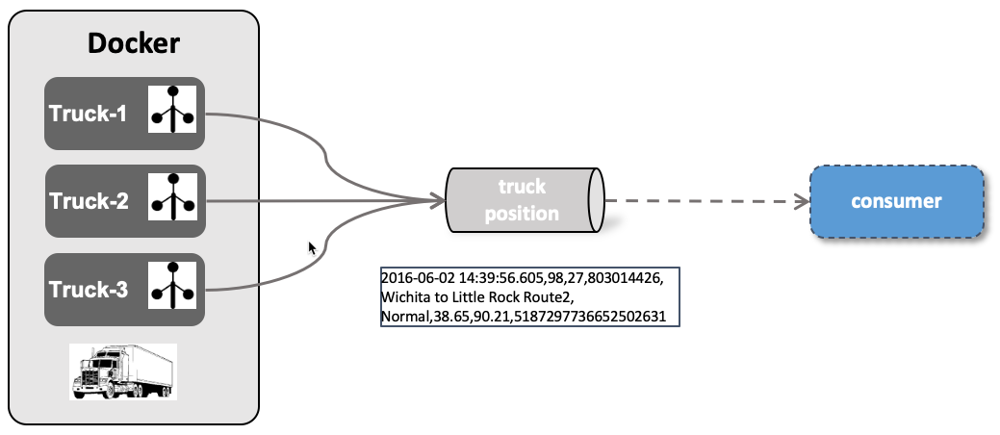
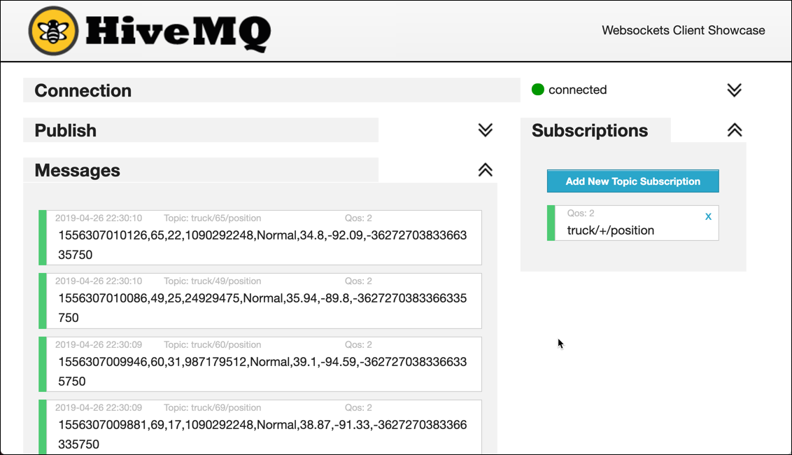

# Streaming IoT Data

For simulating truck data, we are going to use a Java program (adapted from Hortonworks) and maintained in the Trivadis GitHub [here](https://github.com/TrivadisPF/various-bigdata-prototypes/tree/master/streaming-sources/iot-truck-simulator/impl). It can be started either using Maven or Docker. We will be using it as a Docker container. 

The simulator can produce data either to a **File**, **Kafka**, **MQTT** or **JMS** (ActiveMQ). In this workshop we will demonstrate the various options which will then be used in further workshops. 



The simulator accepts the following arguments:

```
-s 		Sink to use, one of FILE, MQTT, KAFKA, JMS, CONSOLE
-h 		Host address (of the broker in case of MQTT and KAFKA)
-p 		Port (of the broker in case of MQTT and KAFKA)
-f 		Message format to use, one of JSON, CSV
-m 		One or more messages 
		- COMBINE = produce a single message with both position and eventType (default)
		- SPLIT = produce one message for positions and one for eventType
-t 		Precision of timestamp
		- SEC = seconds (default)
		- MS = milliseconds
-mt 	JMS Message Type (only if JMS is used) 
		- TEXT = produce a JMS TextMessage		- MAP = produce a JMS MapMessage
		- MAP = produce a JMS BytesMessage
-d 		Delay in milliseconds between sending a message for each truck in the fleet
-fs 	Size of the truck fleet
```

We can slow down the consumer to a slower rate to better see the messages when produced by using the `-d` flag to specify a delay in milliseconds together with the `-fs` parameter to specify the fleet size. 


A few of the scenarios presented below will be shown/used in other workshops.

## Running Simulator with a local file

We can start the IoT Truck Simulator in the `FILE` mode, in wich case the data is just written to a local file. Use the following `docker run` command to start it.

```
docker run -v "${PWD}/data-transfer/logs:/out" --rm trivadis/iot-truck-simulator '-s' 'FILE' '-f' 'CSV' '-d' '6000' '-fs' '25'
```

The filename is currently hard-coded to `TruckData.dat` and it written to the `/out` folder inside the container. 

In another terminal window navigate to the folder from where you have started the simulator and perform a `tail`

```
tail -f logs/TruckData.dat
```

You should see the data being written to the file. This file can now be picked up with a Stream Data Integration tool and processed/forwarded.


## Running Truck Simulator to send truck position messages to ActiveMQ


Producing truck events to the JMS broker on port 61616 is as simple as running the `trivadis/iot-truck-simulator` docker image.

```
docker run --rm trivadis/iot-truck-simulator '-s' 'JMS' '-h' $DOCKER_HOST_IP '-p' '61616' '-f' 'CSV'
```

As soon as messages are produced to ActiveMQ, you should see them either in the ActiveMQ UI or by starting a consumer using the `a` tool. 

```
a -g -j -c 0 -w 0  test.queue.truck_position
```

Or using a slower rate 

```
docker run --rm trivadis/iot-truck-simulator '-s' 'JMS' '-h' $DOCKER_HOST_IP '-p' '61616' '-f' 'CSV' '-d' '6000' '-fs' '25'  
```

Currently the simulator only supports Queues in ActiveMQ. Therefore starting an another consumer in a new terminal window

```
a -g -j -c 0 -w 0  test.queue.truck_position
```

will start a competing consumer to the first one. You should see a message only in either one or the other window. 


## Running Truck Simulator to send truck position messages to RabbitMQ

does not yet work ....

```
docker run --rm trivadis/iot-truck-simulator '-s' 'RABBITMQ' '-h' $DOCKER_HOST_IP '-p' '61616' '-f' 'CSV'
```

## Running Truck Simulator to send truck position messages to Kafka

Write a all in on messages to KAFKA in CSV format

```
docker run --network docker_default trivadis/iot-truck-simulator '-s' 'KAFKA' '-h' 'kafka-1' '-p' '19092' '-f' 'CSV'
```

```
docker run --network docker_default trivadis/iot-truck-simulator '-s' 'KAFKA' '-h' 'kafka-1' '-p' '19092' '-f' 'JSON'
```

## Running Truck Simulator to send truck position messages to MQTT

Producing truck events to the MQTT broker on port 1883 is as simple as running the `trivadis/iot-truck-simulator` docker image.

```
docker run trivadis/iot-truck-simulator '-s' 'MQTT' '-h' $DOCKER_HOST_IP '-p' '1883' '-f' 'CSV'
```

As soon as messages are produced to MQTT, you should see them either on the CLI or in the MQTT UI (Hive MQ) as shown below.




